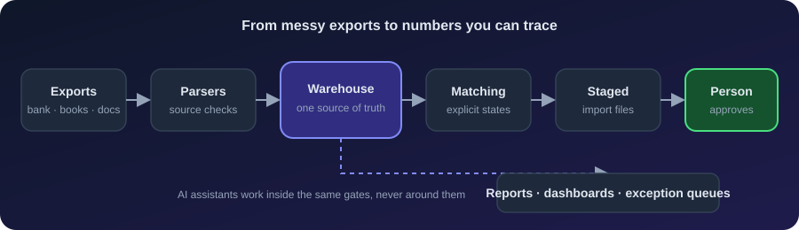
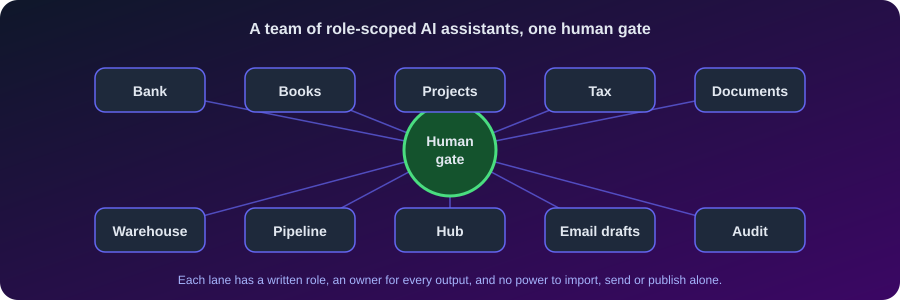

<!-- Header Banner -->

  

<!-- Profile Views + Followers + Location -->

  
  
  

<!-- Animated Typing Tagline -->

  

<!-- Social Badges -->

  
  
  

---

  <b>Accounting professional, 10+ years, now building the systems that replace the manual work.</b> 
  At Day &amp; Night Solar I run a local-first data platform: one warehouse as the source of truth, bank-to-books reconciliation, and role-scoped AI assistants that stage every import, email and publish for a person to approve.

<h3 align="center">The System, End to End</h3>

<table align="center">
<tr>
<td align="center"><b>1,300+</b> automated tests</td>
<td align="center"><b>150+</b> scheduled pipeline steps</td>
<td align="center"><b>100+</b> warehouse tables</td>
<td align="center"><b>0</b> unapproved imports or sends</td>
</tr>
</table>

<h3 align="center">How I Build With AI Agents</h3>

<table align="center">
<tr>
<td width="25%" valign="top" align="center"><b>Unknown is a state</b> Unmatched, stale or missing data stays visible instead of turning into a convenient guess.</td>
<td width="25%" valign="top" align="center"><b>Humans approve</b> Accounting imports, email, tax filings and publishing are staged and handed to a person.</td>
<td width="25%" valign="top" align="center"><b>Every number has a source</b> Answers name the table or file they came from and how old it is.</td>
<td width="25%" valign="top" align="center"><b>Measure the automation</b> Checks read the real output, not the intent. A green run is where the question starts.</td>
</tr>
</table>

<h2 align="center">Core Stack</h2>

  
  
  
  
  
  
  
  

---

<b>More: current work, the system in detail, what running it taught me</b>

<h2 align="center">What I'm Currently Doing</h2>

<table align="center">
<tr>
<td width="33%" valign="top" align="center">

### Building
Internal operations platform at Day & Night Solar — a local-first data platform: one warehouse as the source of truth, reconciliation, document intelligence, and a team of role-scoped AI assistants working under human approval.

</td>
<td width="33%" valign="top" align="center">

### Shipping
**Cinemetrics** — full-stack capstone (Node.js · Express · MongoDB · REST APIs), deployed end-to-end as my SavvyCoders certification project.

</td>
<td width="33%" valign="top" align="center">

### Exploring
Multi-agent orchestration · local LLMs (Ollama) · document forensics · Postgres migration · reproducible finance pipelines.

</td>
</tr>
</table>

<b>More of what I have built</b>

<table>
<tr>
<td width="50%" valign="top">

### Finance Platform
Python/FastAPI + SQLAlchemy service layer designed for Postgres migration. Replaces a spreadsheet-centric close process with a query-able operational database.

</td>
<td width="50%" valign="top">

### QuickBooks Automation
Programmatic IIF generation for customers, POs, invoices, and deposits with anti-duplicate safety checks against tens of thousands of historical transactions.

</td>
</tr>
<tr>
<td width="50%" valign="top">

### Bank Reconciliation Engine
Progressive fuzzy-match engine across 5 bank accounts in a high-volume, multi-account environment. Surfaces discrepancies **before** month-end, not after. Tier-priority confidence scoring with review queues for ambiguous matches.

</td>
<td width="50%" valign="top">

### Executive Dashboards
pandas + openpyxl pipeline covering P&L, cash flow, billing, margin, and schedule. Auto-regenerates — CFO reads the same data leadership does. HTML operations hubs with collapsible sections and clickable file links.

</td>
</tr>
<tr>
<td width="50%" valign="top">

### AI Orchestration Layer
Multi-agent framework on Claude Code — each assistant has a written role, a named owner for every output, and a recorded limit on what it may change. Decisions are logged once and never asked twice; nothing imports, sends, or publishes without a person approving it.

</td>
<td width="50%" valign="top">

### Document Intelligence
OCR + classification + auto-routing for hundreds of incoming vendor docs, bank statements, and internal cost models. Outlook `.msg` / `.eml` forensics pipeline builds defensive timelines for dispute preparation.

</td>
</tr>
</table>

<table>
<tr>
<td width="50%" valign="top">

### Multi-Agent Control Plane
Role-scoped Claude Code assistants with written authority limits, a shared decision record, and lane-to-lane messaging. One owner per output.

</td>
<td width="50%" valign="top">

### Data Contracts
Every table has a declared writer, a freshness rule by real record date, and row-count checks that report a shrink instead of hiding it.

</td>
</tr>
<tr>
<td width="50%" valign="top">

### Reconciliation Engine
Bank-to-books matching with explicit states (confirmed, proposed, no match, excluded) and human decisions that survive a reload.

</td>
<td width="50%" valign="top">

### Quality Gates
CI, pre-commit checks, a release gate before every push, and tests for the failure paths, not only the happy one.

</td>
</tr>
</table>

<b>What running it daily has taught me</b>

- **A committed fix is not a fix that ran.** Check the real log, not the commit.
- **"The pipeline succeeded" can hide failures.** Distinguish skipped, failed and findings.
- **A startup message can silently exceed its cap.** Measure the real output on every start path.
- **A fresh stamp can hide stale content.** Judge freshness by the newest real record.
- **Recording a decision must be cheaper than skipping it.** Answers get asked twice otherwise.
- **Coordination can outgrow the work.** Measure how much of the activity maintains the machinery.
- **Green locally is not green in CI.** Look at the remote run after every push.

<b>Operational scope:</b> Payroll · multi-state sales tax compliance · period close · vendor/customer master data · AR/AP · audit response

<b>Career, full stack and education</b>

<h2 align="center">Career Journey</h2>

<i>From high-volume reconciliation at enterprise scale to building the systems that replace it.</i>

 

<table>
<tr>
<td width="33%" valign="top">

### Day & Night Solar
**Finance & Operations Analyst**  
*Oct 2025 – Present · Collinsville, IL*

Building the internal operations platform end-to-end — a local-first data platform with one warehouse as the source of truth, QuickBooks automation, a bank reconciliation engine, executive dashboards, document intelligence, and a team of role-scoped AI assistants behind human-approval gates, CI, and release checks.

</td>
<td width="33%" valign="top">

### Keeley Companies
**Data Analyst (Contract)**  
*Mar 2025 – May 2025 · St. Louis, MO*

ERP data migration: **SAGE CRE 300 → CMiC**. Extracted, validated, and reconciled large datasets using **SQL, VSCode, and advanced Excel** (XLOOKUP, INDEXMATCH, IFERRORS). Detailed discrepancy reporting to the ETL team.

</td>
<td width="33%" valign="top">

### Curtiss-Wright
**Staff Accountant**  
*Nov 2022 – Aug 2023 · Charlotte, NC*

Financial reporting, reconciliations, budgeting/forecasting on **SAP + Oracle**. Automated data reconciliation processes to reduce manual errors. Sage FAS fixed-asset management.

</td>
</tr>
<tr>
<td width="33%" valign="top">

### Robert Half
**Professional Consultant**  
*Oct 2021 – Jul 2022 · Charlotte, NC*

Financial analysis and reconciliation support across clients including **Elgi, Essity, and Mood Media**. Exploratory analysis to surface inconsistencies; Excel automation for reconciliation.

</td>
<td width="33%" valign="top">

### NTT
**Reconciliation Analyst**  
*May 2019 – Sep 2021 · Charlotte, NC*

Sales tax rebates and vendor reconciliations for enterprise tech clients including **Cisco and Dell**. High-volume invoice processing on **SAP ERP and Oracle**; resolved unmatched discrepancies in holding accounts.

</td>
<td width="33%" valign="top">

### Wells Fargo
**Trading Service Rep**  
*Jan – Mar 2019 · Charlotte, NC*

Sponsorship program — studied for SIE, Series 7, and Series 63 licensing. AML, fraud, and regulatory fundamentals.

</td>
</tr>
<tr>
<td width="33%" valign="top">

### Walmart eCommerce *(Hayneedle)*
**Accounts Payable Associate**  
*May 2018 – Jan 2019 · Charlotte, NC*

Processed and reconciled invoices for **800+ vendors** on **Oracle, Medius, and Readsoft**. Sales tax adjustments, debit memos, vendor credits. Built and led training programs for specialist roles.

</td>
<td width="33%" valign="top">

### Top Nails Tech
**Founder / Business Owner**  
*Aug 2005 – Apr 2018 · Morganton, NC*

Founded and operated a service business generating **$200K+ annual revenue**. Full P&L, payroll, AP/AR, lease negotiations, state compliance. Led a team of six. 10–12% YoY revenue growth through multi-platform digital marketing.

</td>
<td width="33%" valign="top">

### The Through-line
Every role has been about reconciling high-volume financial data across messy source systems. First as a business owner running my own P&L, then inside enterprise ERPs, then modeling the data with ML. Now I build the systems that replace the manual work — with a CPA-grade mindset for controls, audit trails, and safety.

</td>
</tr>
</table>

---

<h2 align="center">Tech Stack</h2>

**Languages**

**Full-Stack Web**

**Backend & Data**

**ML & AI**

**Enterprise Systems** *(from prior roles)*

**Tools & Infrastructure**

<b>Full integration & library list</b>

 

| Category | Stack |
|---|---|
| **Backend** | Python 3.14 · SQLAlchemy · FastAPI · Pydantic · Alembic · PostgreSQL 16 · SQLite · DuckDB |
| **Full-Stack Web** | Node.js · Express · MongoDB · Mongoose · REST APIs · HTML · CSS · JavaScript |
| **Data & Docs** | pandas · NumPy · openpyxl · pdfplumber · PyPDF2 · extract-msg · EasyOCR · pytesseract · BeautifulSoup |
| **Integrations** | QuickBooks Enterprise (IIF) · Microsoft Graph / Outlook (pywin32 COM) · ICS calendar · Chrome DevTools MCP |
| **AI / ML** | Claude Code · Anthropic API · Ollama (llama3.1) · PyTorch · TensorFlow · XGBoost · LightGBM · scikit-learn |
| **Enterprise (prior roles)** | SAP ERP · Oracle · Sage FAS · Medius · Readsoft · CMiC · SAGE CRE 300 |
| **Dev Tooling** | Git · VS Code · pytest · black · flake8 · mypy · pre-commit · uv · Node.js |
| **Automation & Quality** | GitHub Actions CI · pre-commit gates · pytest with failure-path tests · Windows Task Scheduler · release gate before every push |
| **Agentic Engineering** | Claude Code hooks, skills, subagents and MCP · role-scoped agent lanes · recorded decisions · human-approved imports, email and publishing |

---

<h2 align="center">Certifications & Education</h2>

| Credential | Institution | Year |
|:---|:---|:---:|
| **Full Stack Web Development Certificate** | SavvyCoders | 2025 |
| **Data Science Certification** | TripleTen | 2024 |
| **BA in Accounting** | Belmont Abbey College | 2012 |

---

<h2 align="center">Featured System — Project Waffles</h2>

<i>Private, operator-built, in daily use. The architecture is shown above; the code is not public.</i>

<table align="center">
<tr>
<td width="33%" valign="top"><b>Problem</b> Hundreds of exports, statements and documents, several accounting and banking systems, and numbers nobody could trace.</td>
<td width="33%" valign="top"><b>Approach</b> A local warehouse as the single source of truth, parsers that check their sources, reconciliation with explicit match states, and human-approved imports.</td>
<td width="33%" valign="top"><b>What makes it different</b> Role-scoped AI assistants, recorded decisions, row-count and freshness checks, and CI plus a release gate on every push.</td>
</tr>
</table>

<h2 align="center">Featured Project — Cinemetrics</h2>

<i>Full-stack capstone built and deployed end-to-end as my SavvyCoders graduation project.</i>

<b>TripleTen data science portfolio (16 projects)</b>

### EDA & Statistical Analysis
| # | Project | Tech |
|---|---|---|
| 01 | Music preferences between two cities | Python, pandas |
| 02 | Credit scoring — loan default likelihood | Python, pandas |
| 03 | Vehicle price factors from classified ads | pandas, numpy, matplotlib |
| 04 | Telecom plan profitability analysis | pandas, numpy, scipy |
| 05 | Video game market hypothesis testing | pandas, numpy, scipy |
| 06 | Taxi trip duration vs. weather | pandas, numpy, scipy |

### Classical ML
| # | Project | Tech |
|---|---|---|
| 07 | Cell phone plan classification (0.75+ accuracy) | sklearn · Decision Tree, Random Forest, Logistic Regression |
| 08 | Bank client churn prediction (F1 ≥ 0.59) | sklearn · Random Forest, Logistic Regression |
| 09 | Oil well location — reserve volume & regional risk | sklearn · Linear Regression, Random Forest |
| 10 | Gold production process modeling | sklearn · Linear Regression, Random Forest |
| 11 | Insurance benefit prediction with data privacy | sklearn · K-Nearest Neighbors |
| 12 | Car price prediction (speed + quality tradeoff) | sklearn · CatBoost, LightGBM, XGBoost |
| 13 | Taxi orders time-series forecasting (RMSE ≤ 48) | statsmodels · LGBM, Linear Regression |

### NLP
| # | Project | Tech |
|---|---|---|
| 14 | Movie review sentiment classification | nltk · transformers · spaCy · LGBM |

### Deep Learning & Computer Vision
| # | Project | Tech |
|---|---|---|
| 15 | Age estimation from facial photos — regression CNN | TensorFlow/Keras · CNN · GlobalAveragePooling2D |
| 16 | Customer retention prediction (AUC-ROC ≥ 0.75) | TensorFlow · CNN · sklearn ensemble |

---

<h2 align="center">Let's Connect</h2>

  
  
  
  

<b>Open to work</b> — Data Analyst, Junior Software Engineer, or Finance/Operations roles where accounting, data, and code intersect.

<!-- Footer Banner -->

  

